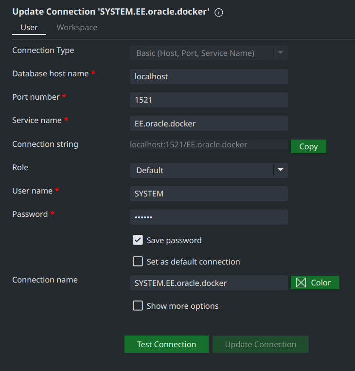

# Oracle EE 11g in Docker

This repository contains the following components running inside docker containers:

- [**Oracle EE 11g database**](https://docs.oracle.com/cd/E11882_01/license.112/e47877/editions.htm#DBLIC109) - ([docker image](https://hub.docker.com/r/loliconneko/oracle-ee-11g))

You can use SQLDeveloper or use [Oracle Developer Tools for VS Code](https://marketplace.visualstudio.com/items?itemName=Oracle.oracledevtools).

If you want the XE version, see [this repository for Oracle XE 11g](https://github.com/usersina/oracle-xe-11g-docker).

## Main Features

- Starter HR data is already configured
- Database in container is fully stateful

## Motivation

During my undergraduate studies of computer science, I was required to use OracleDB for my SQL courses.
The installation process has always been a bit of a hassle, especially considering that the 11g version is quite outdated by now.

Having enrolled in an Engineering University for Computer science and not wanting to face the same experience again, I decided to run it all in docker containers and get on with life.
And potentially helping people who face the same issue in the future.

## Getting started

This guide was tested on Windows with git bash and on Linux running CachyOS 6.11

```bash
make up

# This might take a while, tail the logs with
docker logs -f oracledb
```

And you're all good! Simply use the following credentials to connect to your oracle database as shown in the screenshot with the password being `oracle`.

```txt
hostname: localhost
port: 1521
sid: EE
service name: EE.oracle.docker
username: system
password: oracle
```



- To stop the containers without deleting any data

```bash
make down
```

Note that this will not delete the OracleDB data.
In order to do just that, you would have to

```bash
make delete
```

Connect to Oracle Enterprise Management console with following settings:

```txt
http://localhost:8080/em
user: sys
password: oracle
connect as sysdba: true
```

## Initializing databases

<details>

<summary>This step is not needed anymore since it's added to the compose file.</summary>

## II. Extra setup

You might also want to unlock the HR account to have access to the [HR (or Human Resources) schema](https://www.webucator.com/article/oracles-demo-hr-schema/) which is just a collection of useful tables often used for testing.

### 1. Unlocking HR

HR and a bunch of other tables are now unlocked by default.

To use it simply

- Enter into the running container with the system account

```bash
make shell
```

- Connect with the HR account

```bash
sqlplus HR/HR
```

You can now run queries against the HR database

```SQL
SELECT TABLE_NAME FROM USER_TABLES;
```

</details>

## Accounts

To connect to the database outside the docker network:

```bash
Hostname: localhost
Port: 1521
SID: EE.oracle.docker
```

- Default system account

```bash
user: SYSTEM
password: oracle
```

- HR account (password is case sensitive)

```bash
user: HR
password: HR
```

## More

## Connecting as sysdba

Initially, you will get an error if you attempt to do it

```bash
SQL> connect /as sysdba
```

> ERROR:
> ORA-01031: insufficient privileges

For this, you have to first `make shell` then add the default user (**root**) to the **dba** group.

```zsh
[root@container-id-abc /]# usermod -aG dba root
[root@container-id-abc /]# newgrp dba
```

After that, you can `sqlplus SYSTEM/oracle` and run the same command again

```zsh
[root@container-id-abc /]# sqlplus SYSTEM/oracle
SQL> connect /as sysdba
```

> Connected.

## Troubleshooting

- **Ports are not available:** Either the port is in use or it is excluded by the system. See [this](https://github.com/docker/for-win/issues/9272#issuecomment-731847321) and [most importantly this](https://superuser.com/a/1610009/1024072) for windows.
